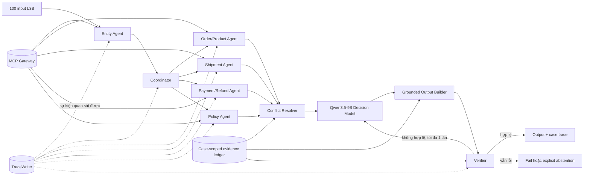

# Kiến trúc L3B — Multi-Agent MCP + A2A

Tài liệu này mô tả kiến trúc đang chạy tại commit `28bb92c`. Mọi quyết định dưới đây đều đối chiếu được với source, contract (hợp đồng dữ liệu), test hoặc trace (dấu vết thực thi). Tài liệu không chứa prompt bí mật, chain-of-thought (chuỗi suy luận nội bộ) hay credential.

## 1. Luồng hệ thống



`Orchestrator.solve()` nhận một case, kiểm tra đủ chín MCP tool bắt buộc, resolve (xác định) tối đa ba order, chạy ba specialist song song, lấy policy và dựng proposal. Output chỉ được finalize sau khi schema, evidence, phép tính và các invariant (điều kiện luôn phải đúng) đều qua verifier.

## 2. Quyền sở hữu của agent

| Actor | Input | Trách nhiệm | Tool được phép gọi | Output/handoff |
|---|---|---|---|---|
| Entity/customer agent | Candidate order IDs, customer hint | Đọc candidate, loại ID không được chứng minh, xác định `resolved/ambiguous/not_found`; tối đa 3 order | `get_order`, `get_customer_history` | `entity_resolution`; handoff `ENTITY_RESOLVED_*` về Coordinator |
| Coordinator | Case, entity resolution, tool discovery | Điều phối specialist, giữ phạm vi case, gom message và quyết định lúc finalize/abstain | Không gọi domain tool trực tiếp | `task_assigned`, payload cho policy/conflict, `case_finalized` |
| Order/product agent | Resolved order IDs | Thu item, product và seller facts | `get_order_items`, `get_product_context`, `get_sellers` | `AgentMessage` và handoff `SPECIALIST_EVIDENCE_READY/INCOMPLETE` |
| Shipment agent | Resolved order IDs | Thu timeline và trạng thái vận chuyển theo order | `get_shipment_summary` | Shipment facts + evidence refs về Coordinator |
| Payment/refund agent | Resolved order IDs | Thu payment và refund timeline; không coi tool error là refund bằng 0 | `get_payment_timeline`, `get_refund_timeline`; `get_order_payments` được contract cho phép nhưng luồng hiện không gọi | Payment/refund facts + evidence refs về Coordinator |
| Policy agent | `policy_version` của case | Lấy policy chính thức áp dụng cho case | `get_policy` | Handoff `AUTHORITATIVE_POLICY_RECEIVED` sang Conflict Resolver |
| Conflict resolver / decision model | Resolution, specialist messages, source facts, policy, ledger và tool failures | Chọn nguồn, tạo decision plan/proposal; không được đổi entity resolution hoặc tham chiếu evidence ngoài case | Không gọi MCP | Output candidate + phép tính gắn `evidence_ref`/JSON pointer |
| Grounded output builder | Output candidate, case, ledger | Materialize (tạo giá trị cuối) từ source facts; ràng buộc shipment, refund, policy action và episode hiện hành | Không gọi MCP | Official output candidate đã gắn nguồn |
| Verifier | Official output candidate, calculations, ledger | Kiểm schema, scope, arithmetic, source linkage, conflict, claim và confidence; có thể từ chối proposal | Không gọi MCP | `verification_completed`; reject trả về Policy Agent tối đa một lần |
| Critic agent, tùy chọn | Case, output, ledger, failures | Review độc lập; chỉ approve/reject, không âm thầm sửa output | Không gọi MCP | Handoff `CRITIC_APPROVED` hoặc chặn case |

Quyền được áp dụng theo least privilege (đặc quyền tối thiểu) trong `CaseEvidence.PERMISSIONS`. Tool discovery chỉ xác nhận tool tồn tại; không mở quyền gọi cho agent khác.

## 3. Entity resolution và A2A protocol

- Input phải có từ 1 đến 20 candidate order IDs; candidate không đọc được được giữ ở trạng thái chưa biết, không bị đánh dấu sai.
- Khi chạy `decision_mode=plan` và customer history chỉ ra đúng một candidate, Entity Agent có thể kết thúc sớm. Nếu chưa đủ căn cứ, agent đọc từng candidate bằng `get_order` rồi mới yêu cầu model resolve.
- Hệ thống chỉ điều tra tối đa ba order đã resolve để giữ query budget (ngân sách truy vấn) hữu hạn.
- `AgentMessage` là message contract (hợp đồng thông điệp) giữa specialist và Coordinator, gồm `message_id`, `case_id`, `sender`, `recipient`, `evidence_refs` và `facts`.
- `case_id` được chèn tại `CaseEvidence.fetch()` và caller không thể ghi đè. Handoff chỉ nhận evidence ref đã tồn tại trong ledger của đúng case.
- Mỗi proposal được sửa tối đa một lần (`repair_attempts <= 1`), nên không có vòng lặp agent vô hạn.
- Trace chỉ ghi sự kiện quan sát được: `case_received`, `task_assigned`, `tool_result_consumed`, `handoff`, `policy_decided`, `verification_completed`, `case_finalized`.

## 4. Vòng đời evidence và conflict

1. `EvidenceGateway` gọi MCP và kiểm response bằng JSON Schema trước khi trả về.
2. `CaseEvidence` lưu evidence theo `evidence_ref`, kiểm nội dung của cùng ref không thay đổi và cache (bộ nhớ đệm) theo cặp tool/arguments trong phạm vi case.
3. Mỗi evidence được sử dụng sinh `tool_result_consumed` cùng domain và `result_hash`.
4. Specialist chỉ handoff ref đã có trong ledger. Evidence không được tái sử dụng giữa case, team, run hoặc scope khác.
5. `source_fact_state()` chuyển evidence thành facts kèm ref và JSON pointer. Decision plan chỉ chọn cặp ref/pointer có trong catalog.
6. `materialize_calculations()` tính số từ evidence thật; positive literal không được giả làm operand.
7. Conflict giữ danh sách source, trường khác nhau và `selected_source`. Source được chọn phải nằm trong chính conflict đó; policy chính thức có ưu tiên cao hơn mô tả tự do.
8. Output cuối phải map từng claim và giá trị tiền về evidence refs; missing evidence được biểu diễn là `insufficient_evidence`, fail hoặc explicit abstention, không được bịa giá trị.

## 5. Xử lý lỗi, retry và hiệu quả

| Failure | Retry budget | Fallback (phương án dự phòng) | Trace/code |
|---|---:|---|---|
| MCP timeout/OSError/transport error | 1 lần thử lại; 2 attempts tổng, timeout 35 giây/attempt, nghỉ 0,25 giây | Sau lần hai: fail case hoặc explicit abstention nếu đã có ledger đủ để tạo kết quả an toàn | `MCP_TRANSPORT_FAILURE`, kèm attempt và error type |
| MCP tool execution error | Không retry cùng tool/arguments | Cache lỗi trong `failed_calls`; chuyển failure cho Coordinator; không tạo evidence rỗng | `MCP_TOOL_EXECUTION_FAILURE` |
| Entity không tìm thấy hoặc mơ hồ | Tối đa 1 model repair; không vượt 20 candidate/3 resolved order | `needs_investigation`, refund bằng 0 hoặc fail nếu không có evidence đọc được | `PROPOSAL_REJECTED`, `AGENT_ABSTAINED` khi được bật |
| Specialist thiếu một nguồn | Không gọi lại lỗi server giống hệt | Handoff evidence đã có với trạng thái incomplete; Policy/Verifier quyết định có đủ căn cứ hay không | `SPECIALIST_EVIDENCE_INCOMPLETE` |
| Source conflict | Không retry MCP chỉ để ép đồng thuận | Giữ cả hai nguồn; chọn theo policy hoặc để unresolved; critic/verifier có thể chặn | `CONFLICTS_EXAMINED` |
| Model HTTP/malformed/truncated output | Không network retry tự động; proposal validation có tối đa 1 repair | Fail hoặc abstain có trace; không dùng output dở dang | `PROPOSAL_REJECTED` hoặc `AGENT_ABSTAINED` |
| Invalid specialist/proposal result | 1 repair turn | Gửi `validation_feedback` và `previous_response`; lỗi lần hai thì fail/abstain | Handoff Verifier → Policy Agent |
| Batch có case lỗi | Chỉ retry case failed bằng `--resume-failed` | Yêu cầu cùng clean commit, model/config, case set và checkpoint hash; lưu attempt cũ | Receipt `incomplete`, attempt history và audit trace |

Ba specialist chạy song song bằng `asyncio.gather`. Batch mặc định chạy bốn case đồng thời và chặn ngoài khoảng 1–32. Cache theo case tránh gọi trùng; mọi MCP call, kể cả call không vào output, vẫn được đếm cho efficiency.

## 6. Verification invariants

Verifier và packager chặn công bố khi vi phạm một trong các điều kiện sau:

- Output, trace và manifest phải đúng JSON Schema; `case_id` phải khớp case set.
- Resolved/rejected candidate phải nằm trong input scope; candidate không đọc được không được tự động reject.
- Mọi evidence ref phải tồn tại trong ledger cùng team/run/case, đã được consume và xuất hiện trong trace khi dùng.
- Phép tính tiền chỉ dùng phép toán cho phép và operand là cặp evidence ref/JSON pointer hợp lệ.
- Refund không vượt refundable balance; balance không vượt captured trừ refunded; `no_action` không được có refund dương.
- Shipment verdict, seller responsibility và action phải khớp timeline của episode hiện hành.
- `selected_source` của conflict phải thuộc `sources`; policy action phải được policy evidence hỗ trợ.
- Confidence nằm trong `[0,1]`; unresolved entity chỉ được `needs_investigation` và refund bằng 0.
- Trace phải có lifecycle đúng thứ tự, event ID không trùng lặp và handoff không tham chiếu evidence ngoài ledger.
- Package chỉ nhận live run hoàn chỉnh, clean source revision, đủ đúng 100 output; demo artifacts bị từ chối.

## 7. Khả năng tái lập

- Python `>=3.11`; dependency ranges được khóa trong `pyproject.toml`.
- Model được phép: `Qwen/Qwen3-8B` hoặc `Qwen/Qwen3.5-9B`; bản đang dùng là Qwen3.5-9B với 9.653.104.368 tham số, phục vụ qua OpenAI-compatible endpoint.
- Request model dùng JSON-only, `enable_thinking=false`, `temperature=0.7`, `top_p=0.8`, `max_tokens=6000`; plan mode giới hạn 2048 token. Endpoint hiện không cung cấp seed, nên bằng chứng tái lập dựa trên clean commit, case-set version, checkpoint, config, evidence, output và trace hash.
- Concurrency mặc định là 4; run directory phải mới và không được tái sử dụng. Resume chỉ cho case failed và giữ archive của attempt trước.
- Receipt ghi commit, dirty state, model fields không nhạy cảm, case inventory và SHA-256 của từng checkpoint.
- Credential chỉ nằm trong `.env` bị ignore; không xuất hiện trong source, output, trace, report hoặc ZIP.

Lệnh kiểm chứng:

```powershell
python -m pytest -q
python -m ruff check src tests tools
day09 demo --count 100 --out .local/runs/demo-check
day09 run --limit 3 --concurrency 1 --out .local/runs/live-smoke
day09 validate --run-dir .local/runs/live-v1
day09 package --run-dir .local/runs/live-v1 --output dist/submission-v1.zip
```
